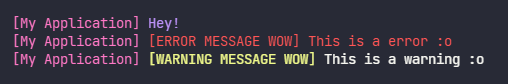

<h1 align="center">
    gulog
</h1>

> A simple console logger.

## Installation

```console
$ npm install gulog
```

## Usage

```js
const log = require('gulog');

// All possible options
log.setup({
    usePrefix: true,
    prefix: '[gulog]',
    prefixColor: 'magenta',
    info: {
        usePrefix: true,
        prefix: '[info]',
        prefixColor: 'cyan',
        messageColor: 'white',
    },
    error: {
        usePrefix: true,
        prefix: '[error]',
        prefixColor: 'redBright',
        messageColor: 'red',
    },
    warning: {
        usePrefix: true,
        prefix: '[warn]',
        prefixColor: 'yellowBright',
        messageColor: 'yellow',
    },
    success: {
        usePrefix: true,
        prefix: '[success]',
        prefixColor: 'green',
        messageColor: 'white',
    },
});

log.info('This is an information :)');
log.success('success, yeah!!!');
log.warning('Whoops... A warning.');
log.error('Oh no! An error 😨 😨');
```

### Result


